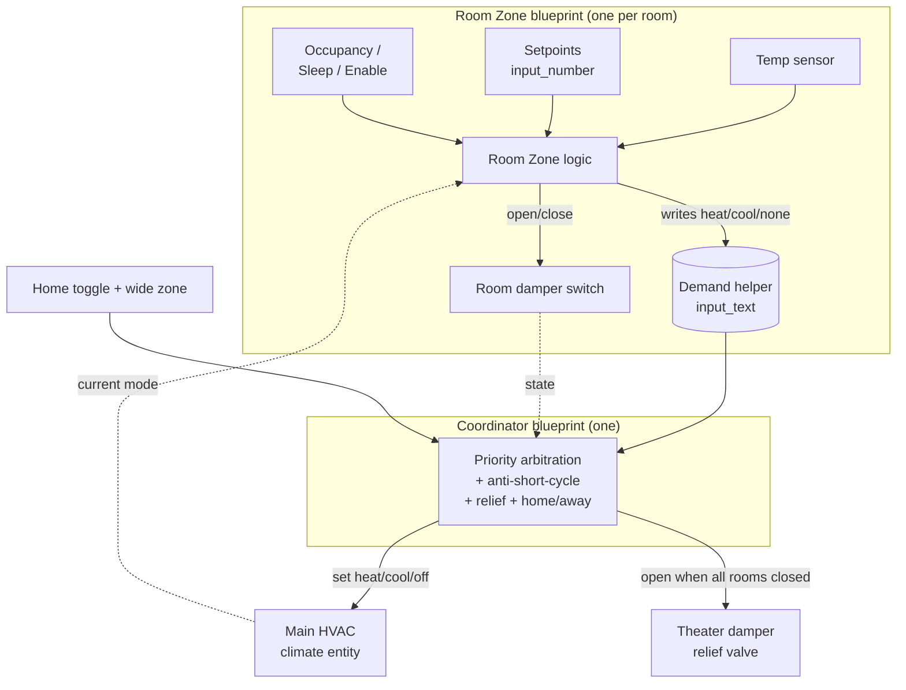

# DIY Smart Zone Controller for Ducted Air Conditioning

Per-room climate zoning for a ducted HVAC system, running **entirely locally** on
Home Assistant — no cloud. Motorized dampers open and close each room's duct
branch based on that room's own temperature, occupancy, and priority, giving one
shared air handler the granularity of a commercial multi-zone system.

It uses an ESP32-based KinCony KC868 relay board to drive 24V AC dampers
(exposed to Home Assistant as `switch` entities), and two Home Assistant
**blueprints** for all of the control logic.

> ⚠️ Work in progress. Expect some rough edges, and test before you deploy.

---

## Credit & what's different here

This project is **based on and inspired by [The Stockpot](https://youtu.be/u8PV-tD-EuY)'s**
ducted zoning build — 👉 *[watch his video here](https://youtu.be/u8PV-tD-EuY)*
for the hardware, the wiring, and the story behind the original idea.

I took that idea and **rebuilt it for my own house.** All of the control logic
in this repo — priority arbitration between rooms, the true two-sided hysteresis
deadband, sleep/pre-cool scheduling, home/away with proximity, and the
pressure-relief handling — is **my own work, implemented entirely in Home
Assistant blueprints rather than in ESPHome.** The ESP board only flips relays;
every decision lives in Home Assistant, which is what let me tailor the behaviour
(room priorities, per-room setpoints, and scheduling) to my own use case.

---

## How it all fits together

There are three moving parts. Sensors feed the **Room Zone** blueprint (one copy
per room), which publishes each room's *demand* and drives its damper. The single
**Coordinator** blueprint reads all the demands, decides the whole unit's
direction by priority, and runs the main HVAC unit and the relief valve.



**Why a demand helper?** A single air handler can only blow hot **or** cold air
at any moment — it can't heat one room while cooling another. So rooms don't just
open their own dampers; they *advertise* what they want, and the Coordinator
picks the winning direction by priority. A room that loses (e.g. it wants cooling
while a higher-priority room is being heated) keeps its damper closed and waits
its turn.

---

## What each module does

### 1. Room Zone blueprint — `blueprints/automation/zone_controller/room_zone.yaml`
Runs once per conditioned room (nursery, master bedroom, server room). For its
room it:
- reads the temperature sensor and compares it to **cool / heat setpoints**
  (with a true two-sided hysteresis deadband, so it engages above the setpoint
  and won't release until back below it — no chatter) to compute a raw demand of
  `heat`, `cool`, or `none`;
- respects a **zone mode** — `standard`, `always_on`, or `occupancy`;
- applies a colder **sleep / pre-cool** setpoint — on demand via a Sleep toggle,
  and automatically during a scheduled evening window;
- honours a hard **enable/disable** toggle;
- writes its demand to an `input_text` helper and opens its damper **only when
  its demand matches the direction the unit is currently delivering**.

> **Damper polarity is inverted / normally-open:** `off` = damper **OPEN**,
> `on` = damper **CLOSED**. A power loss springs every damper open (failsafe).
> The blueprints handle this — you just point them at the right `switch`.

### 2. Coordinator blueprint — `blueprints/automation/zone_controller/zone_coordinator.yaml`
Runs once for the whole house. It:
- reads the room demand helpers **in priority order** and sets the unit's
  direction to the highest-priority room that is calling;
- enforces a short **compressor reversal cooldown** (default 3 min) before
  flipping heat↔cool (unless nothing is still calling in the current direction);
  this cooldown is the only thing that can delay serving a higher-priority room;
- turns the unit **off** when no room is calling, and back on when one is;
- optionally **force-runs the setpoint** — pushing the central thermostat's
  target past the hallway temperature so the unit runs for a room that needs it,
  while respecting manual setpoint changes (a hard override toggle, or a grace
  period after you edit it by hand);
- drives the **theater damper as a pressure-relief valve** — open only when every
  other damper is closed, so the always-open hallway plus the relief path keep the
  duct from over-pressurizing;
- handles **home/away** (a toggle, or anyone inside a wide ~5 mi zone), defaulting
  to an eco preset so an always-on room keeps running while the house is empty;
- honours an optional **house-mode selector** — `Away` forces the eco preset,
  `Vacation` turns the unit off;
- applies a configurable **idle backstop** when no room is calling — off, a
  cooling-only high cap, or a `heat_cool` safety band (default 64–76 °F) that
  keeps the whole house between a low and high limit.

### 3. Helper package — `packages/zone_controller.yaml`
Creates the supporting entities: per-room setpoints (`input_number`), per-room
enable toggles (`input_boolean`), per-room demand helpers plus the coordinator
status line (`input_text`), the changeover timestamp (`input_datetime`), and the
wide presence `zone`. It does
**not** create the sleep-mode or home-occupied booleans — point the blueprints at
your existing ones.

### 4. Firmware — `YAML`
The ESPHome config for the KC868 board that exposes the damper relays to Home
Assistant. Not required reading to use the blueprints, but it's what the `switch`
entities come from.

---

## The rooms

| Priority | Room | Damper(s) | Mode | Setpoints | Enable toggle |
|:--:|------|:--:|------|-----------|:--:|
| 1 | Nursery | 1 | standard, tight band | Heat < 68 °F, Cool > 71 °F | ✅ |
| 2 | Master bedroom | 2 | occupancy, cool-only | Cool > 75 °F day / **> 68 °F sleep** · pre-cools from ~8pm when home | ✅ |
| 3 | Server room | 1 | always-on, cool-only | Cool > 80 °F | ✅ |
| 4 | Theater / bonus | 1 | relief valve | — (automatic) | — |
| — | Hallway | 0 | always open | — | — |

Priority is the **order you list the demand helpers** in the Coordinator. When
directions conflict, the higher-priority room wins the unit: e.g. if the nursery
needs heat while the master needs cooling, the unit heats for the nursery first;
the master waits until the nursery is satisfied. A lower-priority room never
overrides priority — only the short compressor reversal cooldown can briefly
delay the switch.

---

## Installation

### Prerequisites
You need these already in Home Assistant:
- **Room temperature sensors** — one per room.
- **Master bedroom occupancy** — a `binary_sensor` that is `on` when occupied.
- **Damper switches** — one `switch` per damper (5 total; master bedroom has 2).
- **Main HVAC** — a `climate` entity supporting `cool`, `heat`, `heat_cool`, `off`.

### 1. Install the helper package
Copy [`packages/zone_controller.yaml`](packages/zone_controller.yaml) to
`<config>/packages/zone_controller.yaml`. Enable packages in
`configuration.yaml` if needed:
```yaml
homeassistant:
  packages: !include_dir_named packages
```
Edit the file to fill in the `# TODO` values (zone latitude/longitude, and check
the setpoint defaults), then **restart Home Assistant**.

### 2. Import the blueprints
**Settings → Automations & Scenes → Blueprints → Import Blueprint**, and import
both:
- `blueprints/automation/zone_controller/room_zone.yaml`
- `blueprints/automation/zone_controller/zone_coordinator.yaml`

(Or copy them into `<config>/blueprints/automation/zone_controller/`.)

### 3. Create one Room Zone automation per room
Create three automations from the **Room Zone** blueprint — nursery, server room,
master bedroom — pointing each at its own temperature sensor, damper switch(es),
setpoints, enable toggle, and demand helper. The theater does **not** get one.
See [`docs/zone-controller-setup.md`](docs/zone-controller-setup.md) for the
exact per-room field values.

### 4. Create the Coordinator automation
Create one automation from the **Coordinator** blueprint. The important field is
**"Room demand helpers, highest priority first"** — add them in priority order:
`input_text.nursery_demand`, `input_text.master_demand`,
`input_text.server_demand`. Also give it the room dampers, the theater (relief)
damper, the changeover helper, and the home/away entities.

### 5. Add dashboard toggles (optional)
Put the enable toggles (`input_boolean.*_enabled`) plus your existing sleep-mode
and home-occupied booleans on a dashboard for easy control.

Full step-by-step field values and a verification checklist are in
**[docs/zone-controller-setup.md](docs/zone-controller-setup.md)**.

---

## Features

- **Per-room zoning** — every room tracks its own setpoints and occupancy.
- **Priority arbitration** — a single air handler is time-shared by room
  priority; the most important room is served first.
- **Enable/disable per room** — flip a toggle to drop a room out of the system.
- **Compressor reversal cooldown** — a short (default 3 min) heat↔cool changeover
  delay protects the compressor without ever overriding room priority.
- **Setpoint force-run** — pushes the central thermostat's target past the
  hallway temperature so the unit actually runs for a room that needs it, with a
  manual override (hard toggle, or a grace period after a hand edit).
- **Sleep / pre-cool** — the master bedroom drops to a colder target at night,
  via a manual Sleep toggle or automatically during a scheduled evening window.
- **Scheduled activation** — a room can pre-cool on a daily window when the
  house is occupied; the window itself applies the colder night setpoint, so the
  master bedroom actively cools toward 68 °F from around 8pm for a cold bed.
- **Home/away + proximity** — conditioning is reduced when the house is empty,
  resuming when someone comes within ~5 mi.
- **House mode selector** — an optional `input_select` overrides home/away:
  **Away** forces the eco preset (Eco mode), **Vacation** turns the unit off.
- **Idle backstop** — when no room is calling, choose what the unit does: turn
  off, hold a cooling-only high cap, or hold a `heat_cool` safety band (default
  64–76 °F) so the whole house never drifts too hot *or* too cold.
- **Status output** — the coordinator writes a one-line summary of every decision
  to an optional `input_text` (e.g. `Starting cooling - set thermostat to 72° -
  Home`), updated only when the decision changes, so you can see at a glance what
  it did and why.
- **Pressure relief** — the theater damper opens automatically so the duct is
  never over-pressurized.
- **Fail-open** — normally-open dampers spring open on power loss.
- **100% local** — no cloud dependency.

---

## 💬 Got questions?

For anything about **this** build (the Home Assistant blueprints and control
logic), open an issue here and I'll do my best to help. For the original hardware
build, see [The Stockpot's channel](https://www.youtube.com/@TheStockPot-AU).

## License

MIT — use it, break it, fix it, share it.
